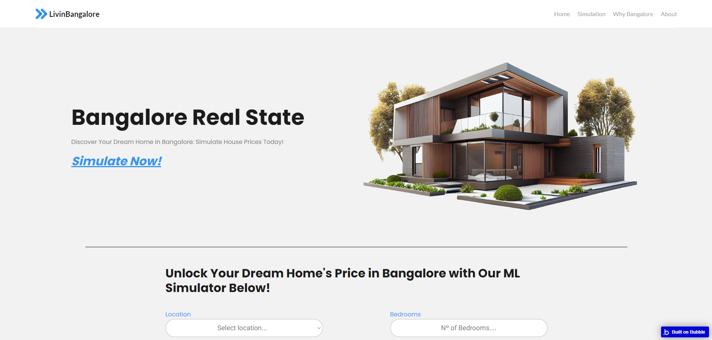
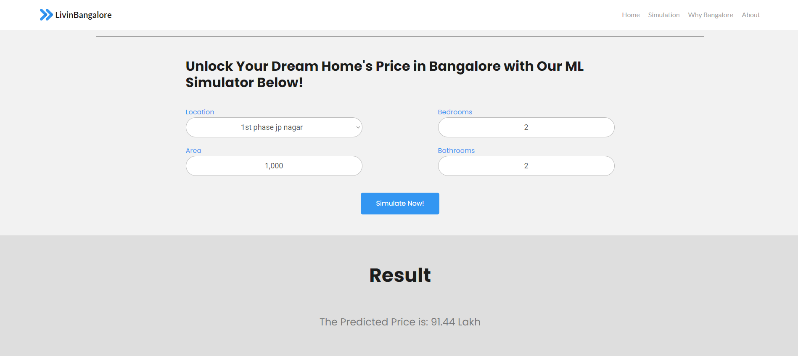

# LivinBangalore
## Discover Your Dream Home in Bangalore: Simulate House Prices Today!

Welcome! This project was created to develop better understanding of how a data science project works. Here, I used a lot of different tools:
* [Kaggle Notebooks (Jupyter)](https://www.kaggle.com/) | General Model Production and Data Analysis
* [Python](https://www.python.org/) - [Pandas](https://pandas.pydata.org/) - [Seaborn](https://seaborn.pydata.org/) | Data Manipulation - Cleaning - Visualization
* [ScikitLearn](https://scikit-learn.org/stable/index.html) | Linear Model Generation and Training
* [Bubble](https://bubble.io/) | Front-End Aplication
* [Flask](https://flask.palletsprojects.com/en/3.0.x/) - [PythonAnywhere](https://www.pythonanywhere.com/) | API Server with available model for predictions

This was a very well structured project with a lot of different experiences. You can check the final product [on this website](https://livinbangalore.bubbleapps.io/version-test)

It is a website in wich the greatest feature is the prediction of House prices in the Bangalore city in India, during data analysis and model training it was detected that the best parameters for describing a house price were:
* Location within the city
* Total area (ft²)
* Number of bedrooms
* Number of bathrooms

By inserting these values of your desired house, the model predicts an aproximate price in Lahks

## How was the project made
### Data analysis, cleaning, visualization
Starting from the start, I followed [this Codebasics project](https://www.youtube.com/watch?v=rdfbcdP75KI&list=PLeo1K3hjS3uvCeTYTeyfe0-rN5r8zn9rw&index=23) in their Machine Learning for Data Science playlist on youtube. There, I was provided with a [Real State Database](https://www.kaggle.com/datasets/amitabhajoy/bengaluru-house-price-data) and an objective: make a prediction model with all that data.

The start was a lot of data modeling and cleaning: Fixing NaN values, removing outliers, performing One Hot Encoding and using domain knoledge and data visualization to only gather information that made sense.

You can check the notebook file [here on this repository](priceprediction-model-notebook.ipynb) or on [Kaggle](https://www.kaggle.com/code/jpbetanza/housepriceprediction-model/edit), where I originaly made it.

### Model training

After the dataset was adjusted to fit a model, 3 models were trained and the Linear Model had the best performance. The model was then saved as a pickle file and hosted alongside a Flask Server on [PythonAnywhere](https://www.pythonanywhere.com/) to be used as an API.

### Front-End Application

With [Bubble](bubble.io), a simple website was created with 4 inputs for the 4 best describing features on the dataset/prediction model and, after connecting to the Flask API, results were shown by entering the desired values for the perfect house in Bangalore!

[The Website](https://livinbangalore.bubbleapps.io/version-test)

### Conclusion
This was a very fun and complete project. It has been a while since I've built a fullstack application, and this was the first time I implemented a machine learning model to create a new feature on a website. A very nice experience.